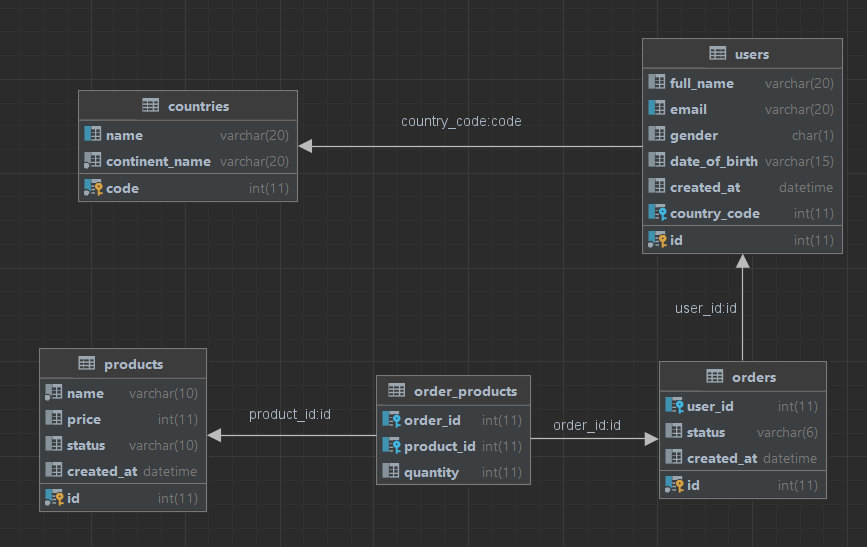

# Database HomeWrok


## Create Database:
```SQL
create database store;
```
## Create Tables:
```SQL
create table countries (
    code int  primary key ,
    name varchar(20) unique,
    continent_name varchar(20) not NULL
);

create table users (
    id int primary key ,
    full_name varchar(20),
    email varchar(20) unique ,
    gender char(1) check ( gender='m' or gender='f' ),
    date_of_birth varchar(15),
    created_at datetime,
    country_code int ,
    foreign key (country_code) references countries(code)
);

create table orders (
    id int primary key ,
    user_id int ,
    status varchar(6) check ( status='start' or status='finish' ),
    created_at datetime,
    foreign key (user_id) references users(id)
);

create table products(
    id int primary key ,
    name varchar(10) not null ,
    price int default 0,
    status varchar(10) check ( status='valid' or status='expired' ),
    created_at datetime
);

create table order_products(
    order_id int ,
    product_id int,
    quantity int default 0,
    foreign key (order_id) references orders(id),
    foreign key (product_id) references  products(id)
);
```
### DML insert:
```SQL
insert  into countries values ('1' , 'Saudi Arabia' , 'Asia');
insert  into users values ('1' , 'Khaled alfawaz' , 'Khaled@gmail.com' , 'm' , '16/8/1999' , '2023-2-27' , '1');
insert  into orders values ('1' , '1' , 'start' , '2023-2-27');
insert  into products values ('1' , 'glasses' , '700' , 'valid' , '2023-2-27');
insert  into order_products values ('1' , '1' , '3');
```

### DML update:
```SQL
update countries set name='Kuwait' where code = '1';
```

### DML delete:
```SQL
SET FOREIGN_KEY_CHECKS=0;
delete from products where id = '1';
SET FOREIGN_KEY_CHECKS=1;
```
